# 该包主要是检测激光雷达状态并读取激光雷达数据
# 两个激光雷达如何使用
**1.**如果使用两个网口激光雷达一定要买交换机，[淘宝链接](【淘宝】https://m.tb.cn/h.5SVvc4P?tk=KCHpWYg2jH3),图片如下所示，注意购买右边使用DC头供电的交换机，DC供电比较稳定，供电线好焊接，且供电电压范围是5V～24V，现在车上使用的是通过NUC的稳压模块给交换机供电：
**注意:**买右边的，右边的是DC头供电
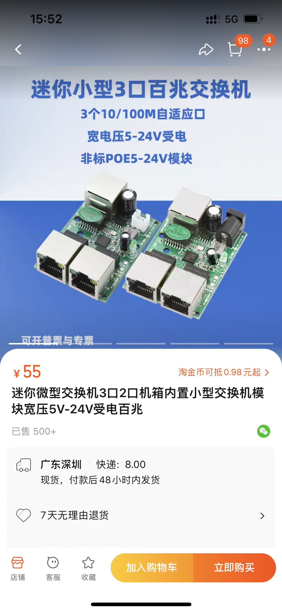
2. 按照下面激光雷达配置完成后，把两个激光雷达插在交换机上，然后交换机引出来一条线插在PC网口上，即可两个雷达同时使用
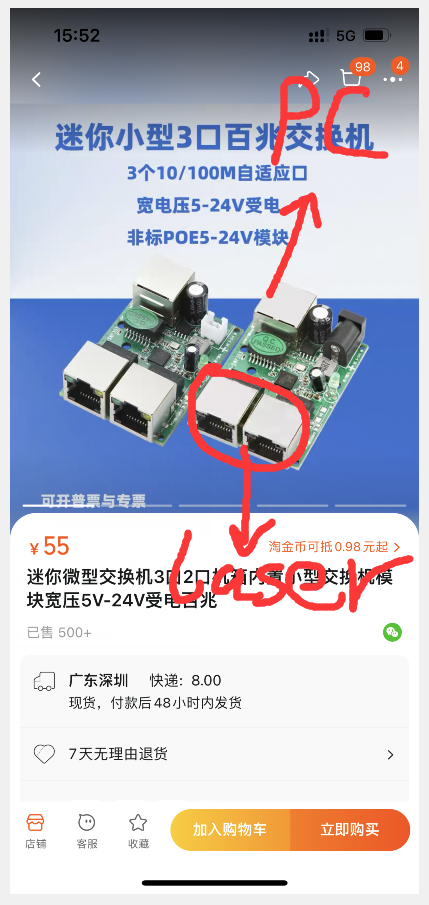
3. 简单说一下两个雷达测试步骤，在以上准备工作完成后，在电脑上打开两个终端，分别ping 192.168.0.10和ping 192.168.0.50，如果ping通则雷达工作正常则有下图:
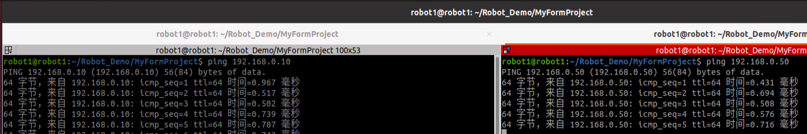
4. 通过rviz显示两个激光雷达的消息，启动two_laser_test.sh即可
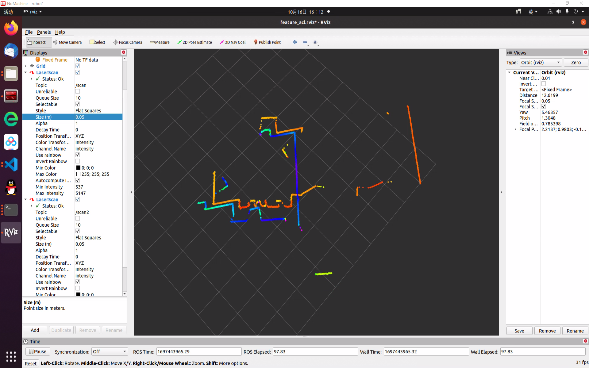
## 激光雷达如何配置
如果系统版本使用的是ubuntu18.04及以下版本可以按照文件<HOKUYO UST-10LX使用资料>
如果系统版本使用的是ubuntu20.04及以上：
1. 点击ubuntu系统界面右上角设置按钮
2. 在网络下面选择PCI以太网
3. 进入PCI以太网配置如下：
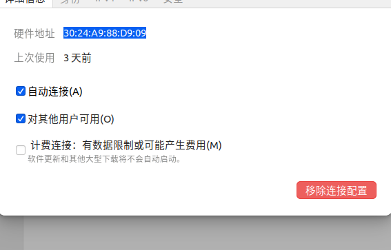
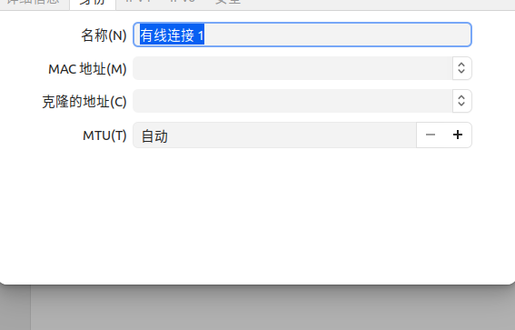
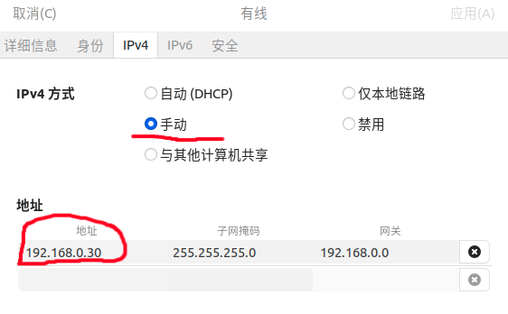
**重点：**这里的地址192.168.0.30是重点，设定时一定设定为192.168.0.10以外的地址，且不能自动选择IP。如果设定完成之后激光雷达通过网口连接之后，如果不能上网的话可以在网上搜索ubuntu如何设置无线和有线网络同时使用
4. 配置成功之后先ping 192.168.0.10/192.168.1.10进行测试，如果ping通则配置成功，可以按照后续的教程启动节点并启动rviz观察点云状况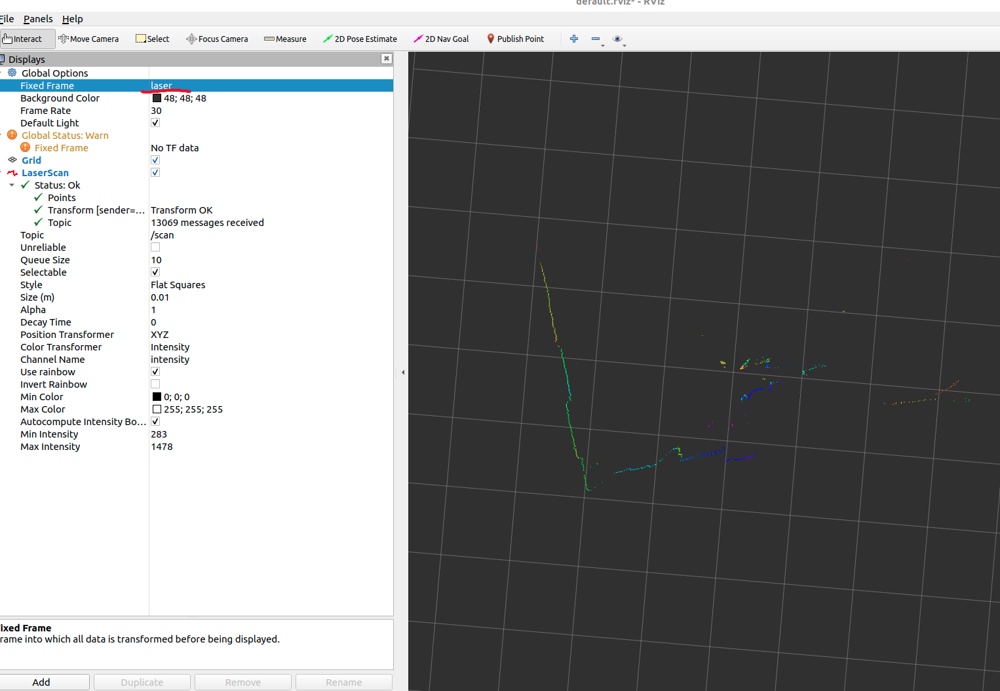
5. 写了一个.sh文件用于一键启动激光雷达连接测试，在**ping 通**之后进行测试，**在启动.sh文件的时候查看.sh文件中的雷达地址和ping的地址相同**
**注意：**以上过程是配置一个HOKUYO UST-10LX雷达的过程，如果需要使用第二个激光雷达，激光雷达的配置步骤如下
1. 首先去[北洋激光雷达官网](https://sourceforge.net/projects/urgbenri/)下载激光雷达对应的软件
2. 之后按照如下教程进行配置以太网[北阳、星秒雷达win10下的使用](https://blog.csdn.net/JCSY_support/article/details/129362606)
**3.**这其中主要是对以太网设定如下:
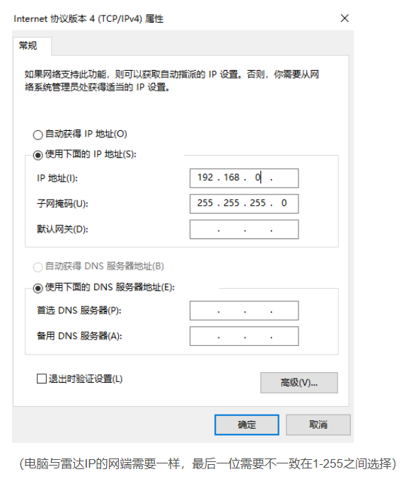
**4.**剩下的跟着教程中的配置走就可以了，使用软件**UrgBenriPlus**将激光雷达的IP设定为192.168.0.50的地址
5. ubuntu的设定参照第一个激光雷达的设定，但是建议是使用一个网口拓展坞，如果不使用拓展坞的话，直接使用第一个雷达配置的网口就可以和雷达连通，ping通即可
**以下是laser2_change_param.launch的启动文件，其中注释标注出了使用的注意事项**
```c++
<!-- 根据雷达的安装位置需要确定雷达扫描范围，剔除掉盲区位置，在运行定位算法的时候需要配合该节点运行 -->
<launch>
  <!-- urg2_node 启动2号雷达的name不能和1号雷达的name一样 -->
  <node name="urg2_node" pkg="urg_node" type="urg_node"  output="screen">
    <!-- 网口雷达ip地址 -->
    <param name="ip_address"         type="string"    value="192.168.0.50"/>
    <!-- 是否反向，不反向 -->
    <param name="inverted"         type="bool"      value="false"/>
    <!--  -->
    <param name="angle_compensate" type="bool"      value="true"/>
    <!-- 最小扫描范围 -->
    <param name="angle_min"        type="double"    value="-2.355"/>
    <!-- 最大扫描范围 -->
    <param name="angle_max"        type="double"    value="2.355"/>

    <!-- 将雷达发布话题名称改称/scan2 -->
    <remap from="scan" to="/scan2" />
  </node>
</launch>
```
## 雷达的安装位置
### 单个雷达安装(按照比赛的时候安装的)
如果车还使用的ICRA2022年比赛方案定下来的雷达安装位置，即雷达在车的左上角或者右上角，这里需要注意一下雷达laser_link与base_link即雷达和底盘之间的几何关系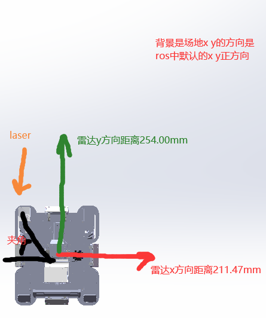：这里注意夹角的运算，因为在建图或者定位过程中，需要考虑二者的tf坐标变换，**注意图中雷达的安装方式是倒过来安装的，除了需要计算yaw姿态角度，roll的姿态角度为180度也就是pi，包括水平方向上的距离参数在实际应用的时候都需要在urdf文件中进行修改**
### 双雷达安装
双雷达安装位置如图所示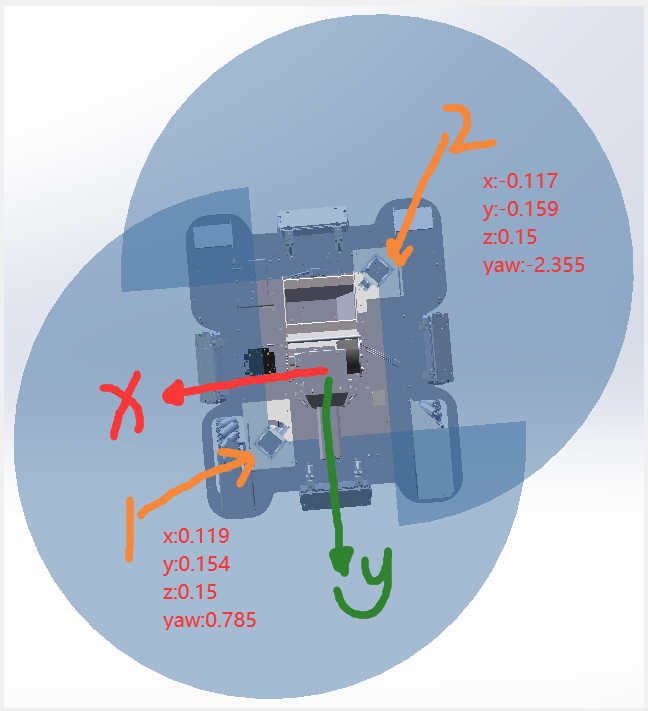，几何尺寸已经给出，代码中需要注意的是新增加了一个**laser2_to_cloud_node.cpp**，与之相对应的launch文件是**laser2_to_cloud.launch**文件，重要代码有以下部分：
```c++
// 代码实现流程逻辑是 先将激光雷达数据转换成sensor_msgs::PointCloud2点云数据格式
// 之后将sensor_msgs::PointCloud2点云转换成pcl::PointCloud点云数据格式
// 对pcl::PointCloud点云数据格式下的点云执行雷达和车底盘之间的坐标变换
// 将雷达坐标系下的点云数据转换成车底盘坐标系下的点云数据
// 再把pcl::PointCloud点云数据格式转换成sensor_msgs::PointCloud2的点云数据格式进行发布
void ScanCallback(const sensor_msgs::LaserScan::ConstPtr &scan_in)
{
  sensor_msgs::PointCloud2 cloud;
  projector.projectLaser(*scan_in,cloud);
  // scan_pub.publish(cloud);

  // 局部点云数据
  pcl::PointCloud<pcl::PointXYZ> laser2cloud;
  // 将pointCloud转换为pcl::PointCloud
  pcl::fromROSMsg(cloud,laser2cloud);

  pcl::PointCloud<pcl::PointXYZ> pcl_cloud_out;
  pcl_cloud_out.header.frame_id = "base_link";

  Eigen::Affine3f transformation_matrix = Eigen::Affine3f::Identity();
  // 旋转操作（绕 Z 轴旋转 theta 弧度）
  transformation_matrix.rotate(Eigen::AngleAxisf(laser_yaw,Eigen::Vector3f::UnitZ()));
  // 平移操作（x, y, z 表示位移向量）
  transformation_matrix.translation() << laser_x, laser_y, laser_z;

  for (const pcl::PointXYZ& point : laser2cloud) {
    // 执行坐标变换
    pcl::PointXYZ transformed_point;
    Eigen::Vector4f input_point(point.x, point.y, point.z, 1.0);
    Eigen::Vector4f output_point = transformation_matrix * input_point;
    transformed_point.x = output_point[0];
    transformed_point.y = output_point[1];
    transformed_point.z = output_point[2];

    pcl_cloud_out.points.push_back(transformed_point);
  }  
  
  sensor_msgs::PointCloud2 ros_cloud;
  pcl::toROSMsg(pcl_cloud_out,ros_cloud);
  ros_cloud.header.frame_id = "base_link";

  scan_pub.publish(ros_cloud);
}
```

## 主要节点介绍
### feature_detection_node.cpp
点云特征扫描节点，运行feature_detection.launch并开启ros_gazebo_control功能包中的show_car_world_gazebo.launch即可以看到特征匹配的状态，运行keyboard_control.launch即可使用键盘控制节点对当然这是在仿真情况下的模拟，并没有真正的接入激光雷达
**注意：**
feature_acl.rviz 是启动真实雷达的rviz文件
feature_sim.rviz 是启动仿真雷达的rviz文件
### laser_scan_node.cpp
激光雷达扫描节点，启动该节点可以接收到激光雷达发布的点云信息，当然该节点只是接收到仿真模拟的激光雷达消息
## launch文件介绍
### feature_detection_acl.launch
文件用来进行特征点扫描，可以在rviz中进行查看，该文件启动的是实际的激光雷达
### feature_detection_sim.launch
文件用来进行特征点扫描，可以在rviz中进行查看，该文件启动的是仿真的激光雷达
### laser_scan_acl.launch
启动雷达扫描的文件，启动的是真正的雷达
### laser_scan_sim.launch
启动雷达扫描的文件，启动的是仿真的雷达
### laser_change_param.launch
雷达参数设定文件，该文件中包含雷达范围、扫描方向、角度等的设置，因为雷达安装和实际使用情况，在使用之前需要进行设定
### laser2_change_param.launch
第二个雷达参数设定文件，该文件中包含雷达范围、扫描方向、角度等的设置，因为雷达安装和实际使用情况，在使用之前需要进行设定
### laser_to_cloud.launch
雷达数据转点云数据，包括实际雷达数据转点云数据和仿真雷达数据转点云数据，在使用的时候注意修改以下的代码：
**注意：这里在接收到雷达数据之后，接收了一个雷达相对车体的坐标变换，必须把雷达的点云数据转换成车体的点云数据，然后发布，最终如果局部需要雷达数据，通过简单的坐标变换即可转换成局部地图数据(局部地图也是在世界地图坐标系下的局部地图)，所以要转换成局部地图数据**
```c++
void Laser_to_Cloud::scanCallback(const sensor_msgs::LaserScan::ConstPtr& scan){
  sensor_msgs::PointCloud2 cloud;
     
  //使用tf的转换 将雷达数据转换成点云数据
  projector_.transformLaserScanToPointCloud("laser", *scan, cloud, tfListener_);
  // 仿真的时候是laser_link
  // projector_.transformLaserScanToPointCloud("laser_link", *scan, cloud, tfListener_);

  /*将 sensor_msgs::PointCloud2 转换为　pcl::PointCloud<T> */
  //注意要用fromROSMsg函数需要引入pcl_versions（见头文件定义）
  pcl::PointCloud<pcl::PointXYZ> rawCloud;
  pcl::fromROSMsg(cloud, rawCloud);

  sensor_msgs::PointCloud2 carcloud;
  // 将雷达的点云数据转换成车的点云数据
  try {
      // 将激光雷达数据从激光雷达坐标系变换到小车坐标系
      tf::StampedTransform transform;
      laser_tf_car_listener.lookupTransform("base_link", cloud.header.frame_id, cloud.header.stamp, transform);
      pcl_ros::transformPointCloud("base_link", cloud, carcloud, laser_tf_car_listener);
  } catch (tf::TransformException& ex) {
      ROS_ERROR("Transform failed: %s", ex.what());
  }

  // 发布点云数据
  point_cloud_publisher_.publish(carcloud);
}
```
