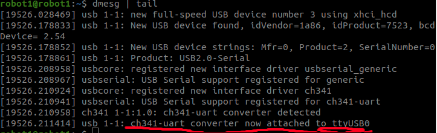

# 该包主要是写的串口和下位机之间通讯的协议
## 截止到2023-04-19，算法主要是实现了和下位机之间的测试通讯，有下位机定时器中断产生10us即100Khz的中断计数，将计数发送到上位机
## 截止到2023-07-07，算法的代码结构进行了更换，采用boost库下的串口代码，并整合了严峻涵的串口代码，丢包率从原来代码的5%降低到2%
## 实现过程：
参照2022年ICRA比赛中使用的串口通讯部分代码，串口的配置参数为：波特率460800、无奇偶校验、停止位1
改进的部分主要是该代码中加入了CRC校验，采用的是16位的校验，目前下位机以500hz进行发送，上位机接收正确率目前为100%，这比我们之前比赛的通讯正确率得到了极大的提升，经过后来测试，**只有在纯接收的时候可以保证百分百正确率，如果上位机有指令发送，那么500hz会有2%的丢包率，200hz基本上没有丢包**
目前校准的方法是帧头两位固定，帧尾两位为CRC校验为来确定当前消息是否正确
```c++
// 串口初始化配置文件
Usart_Config();
// 读取串口数据到缓冲区
// 缓冲区数据解析为串口解码部分
// 目前枕头两位为0x03 0xfc
// 校验过程：先判断帧头两位对不对，如果帧头对，那么用一个数组将当前缓冲区进行储存，并单独保存最后两位，之后对存储数组进行CRC校验，校验结果和单独保存的最后两位结果相等，那么当前数据有效，进行高低八位的解码
// 数据采用高低八位进行传输:
// 下位机发送速度数据v=6000  v_h = 6000>>8 v_l = 6000&0xff
// 上位机接收数据解码 v = v_h<<8 + v_l = 6000  
// 读取串口数据
int usartConfig::ReadUsart() {
  // 当串口打开的状况下
  if (serial_port_->is_open()) {
    while (true) {
      try {
        // 当开始接收
        if (recv_buff.ON_RECV_HEADER) {
          // 接收字符串长度大于1
          if (recv_buff.recv_len < 1) {
            // 开始读取数据长度
            int recv_len = boost::asio::read(
                *serial_port_, boost::asio::buffer(recv_buff.buff, 1));
            // 当长度小于等于0的时候
            if (recv_len <= 0) {
              return -3;  // Read No Data
            }
            recv_buff.recv_len = recv_len;
          }
          // 当第一位为frame_header 且没有犯错误的情况下，
          if (recv_buff.buff[0] == frame_header && (!recv_buff.WRONG_TICK)) {
            recv_buff.ON_RECV_HEADER = false;
          } else {
            // 没有犯错
            recv_buff.WRONG_TICK = false;
            bool find_header = false;
            // 对接收到的数据进行判断
            for (int i = 1; i < recv_buff.recv_len; i++) {
              // 当接收的数据中位为frame_header的时候
              if (recv_buff.buff[i] == frame_header) {
                // 重新计算字符串长度
                recv_buff.recv_len = recv_buff.recv_len - i;
                // 将字符串进行复制
                memcpy(recv_buff.buff, recv_buff.buff + i, recv_buff.recv_len);
                // 
                recv_buff.ON_RECV_HEADER = false;
                // 接收类型正确
                recv_buff.ON_RECV_TYPE = true;
                // 接收数据正确
                recv_buff.ON_RECV_DATA = true;
                // 寻找到了header
                find_header = true;
                break;
              }
            }
            // 当没有header
            if (!find_header) {
              // 串口接收buff复位
              recv_buff.reset();
              // header设定为正确
              recv_buff.ON_RECV_HEADER = true;
              recv_buff.ON_RECV_TYPE = true;
              recv_buff.ON_RECV_DATA = true;
            }
            continue;
          }
        }

        // 当接收数据类型正确
        if (recv_buff.ON_RECV_TYPE) {
          // 当buff长度小于2
          if (recv_buff.recv_len < 2) {
            // 再次读取串口数据
            int recv_len = boost::asio::read(
                *serial_port_, boost::asio::buffer(recv_buff.buff + 1, 1));
            // 如果接收数据长度还小于0 返回值-3
            if (recv_len <= 0) {
              return -3;
            }
            recv_buff.recv_len = 1 + recv_len;
          }
          // 第二位的标志在 0x01 到 0x05之间
          if (recv_buff.buff[1] == 0xfa) {
            recv_buff.ON_RECV_TYPE = false;
          } else {
            // 犯错有问题
            recv_buff.set_wrong_tick();
            continue;
          }
        }

        // 
        if (recv_buff.ON_RECV_DATA) {
          // 获取数据长度
          int expected_recv_len = RX_LENGTH;
          // 如果接收到的数据长度小于期望的数据长度
          if (recv_buff.recv_len < expected_recv_len) {
            // 读取串口的接收长度
            int recv_len = boost::asio::read(
                *serial_port_,
                boost::asio::buffer(recv_buff.buff + recv_buff.recv_len,
                                    expected_recv_len - recv_buff.recv_len));
            if (recv_len <= 0) {
              return -3;
            }
            // 接收到的数据长度 为 原长度+读取到的字符串长度
            recv_buff.recv_len = recv_buff.recv_len + recv_len;
          }
          // 当接收到的长度小于期望长度返回错误码-2 
          if (recv_buff.recv_len < expected_recv_len) {
            return -2;  // Read Length Error
          }
          // 进行CRC校验,正确则返回true 
          if (usart_check.Verify_CRC16_Check_Sum(recv_buff.buff, expected_recv_len)) {
              // 对接收数据进行解码
              recData_Decode();
              /* 时间戳解算 */
              uint32_t time_stamp_10us = recv_buff.buff[12] << 28 | recv_buff.buff[13] << 24 | recv_buff.buff[14] << 16
                                        | recv_buff.buff[15] << 8 | recv_buff.buff[16];

              // cout<<time_stamp_10us<<endl;
              if(freqFlag == 1)   //当标志位置1此时开始打印
              {
                freq++;
              }
            recv_buff.ON_RECV_DATA = false;
          } else {  //CRC校验错误
            recv_buff.set_wrong_tick();
            return -1;  // CRC Error
          }
        }
        return recv_buff.buff[1];
      } catch (...) {
        return -3;
      }
    }
  } else {
    return -4;  // Usart Offline
  }
}
```

## 总结：
再加入了上位机向下位机发送之后即双向收发实现之后，经过测试CRC校验只能保证解算的代码没有乱码，丢包率仍然存在，而且比加入CRC之前变高了，因为没有CRC错误的数据也可能被解码。这里经过多种检测，下位机500hz自发自收没有问题，上位机最快自发自收只能到**50hz**，这个问题目前无法解决，上位机发送频率越高，接收数据的丢包率越高，目前上危机发送的频率改成了50hz，下位机发送的频率降低到了200hz。如果想解决需要研究CPU线程分配和C++中Serial库的底层代码

## 环境搭建：
**注意：**可能还需要其它的环境这里到时候缺哪个装哪个，实在是记不起来了
### 安装ubuntu20.04系统安装CH340驱动并使用串口调试助手
1. sudo apt-get install ros-noetic-serial
2. sudo apt-get install sox libsox-fmt-all
3. 在安装完驱动之后可以安装一个串口助手cutecom：sudo apt-get install cutecom 注意波特率使用的是**460800**
   另一个比较好用的串口助手[serials串口调试工具](https://github.com/h167297/serials)**注：相比于cutecom更好用功能更多，serials串口调试工具deb安装包在同级目录tools下名为serials_amd64.deb**
4. 串口连接后通过dmesg | tail 可以查看当前串口使用的设备文件：，因为我使用的串口转USB是CH341所以这里是CH341，在使用的时候注意使用的串口转USB芯片型号
5. 如果4无法查询端口号，请输入sudo chmod 666 /dev/ttyUSB0 之后再进行查询这个应该是给串口权限的 

## 使用方法：
1. 随便创建一个工作空间，取名work_space
2. 在工作空间创建src文件，将robot_usart功能包复制进去
3. 在work_space工作空间下开启终端，输入catkin_make进行编译
4. 编译通过后终端输入source ./devel/setup.bash
5. 启动节点：roslaunch robot_usart usart_node.launch  启动节点前要关闭串口调试助手
6. 在启动上述代码部分之前要将下位机串口配置完毕，向上位机发送代码
